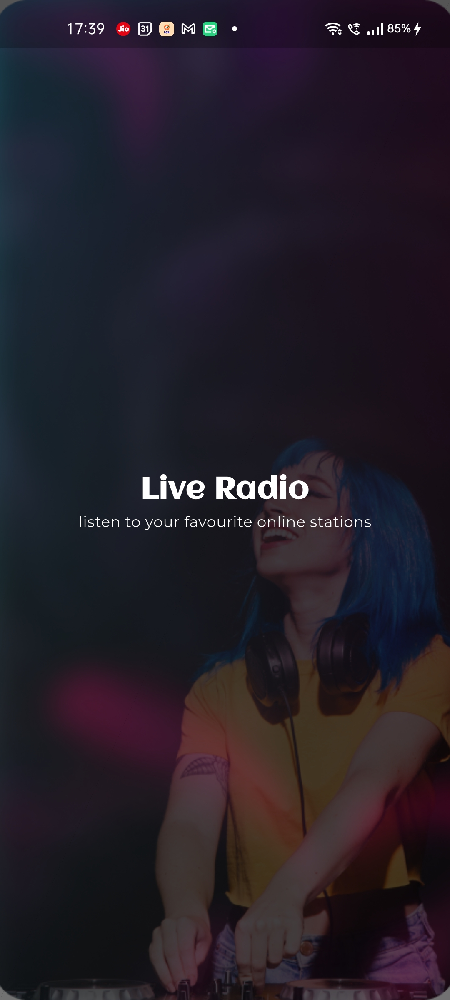
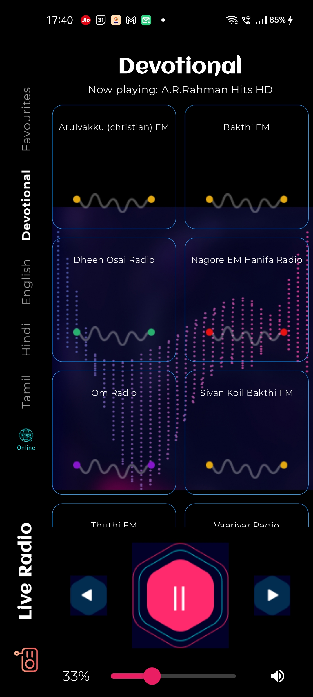
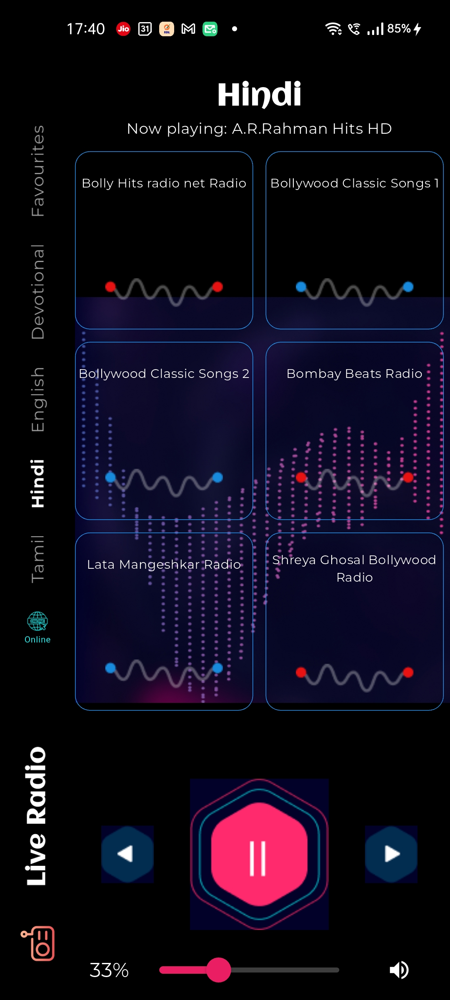
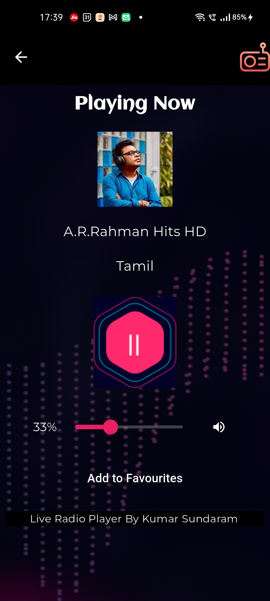
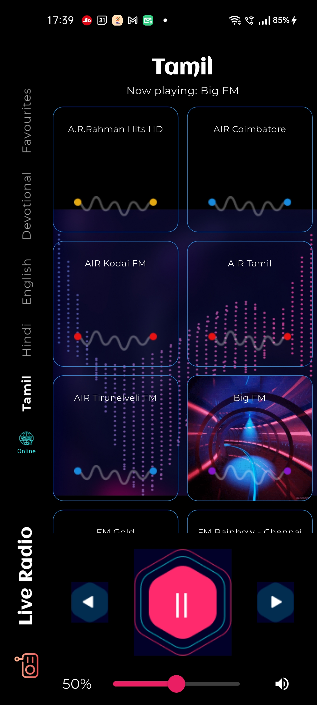

# Live Radio

This Flutter app plays live radio stations available online. It's a simple to use app with a list of popular radio stations. You can click on the radio station to play it. The app also supports playing the radio station in the background. The app is written in Dart and uses the Flutter framework. You can add your own online radios available.
The app is available in both Android and iOS platforms.

Completely rewritten the UI based on the free Figma UI Kit https://dribbble.com/shots/14402323-Radio-App-Concept

## Screenshots

Here are some screenshots of the Live Radio app:

### Home Screen



### Radio Station List



### Radio Station List Filter by Language



### Currently playing Stations



### Station Playing



# Download the APK

Download the APK if you want to test, explore the app

- [Download APK](release/app-release.apk)
- [SHA1] 3c8275f3dacd508ff2a8c95136c70105ce38ef28

## Getting Started

Follow these steps to build and run the Live Radio app on your local machine:

### Prerequisites

1. **Flutter SDK**: Ensure you have Flutter installed. You can download it from the [official Flutter website](https://flutter.dev/docs/get-started/install).
2. **Dart SDK**: Dart is included with Flutter, so no separate installation is needed.
3. **Android Studio**: For Android development, install [Android Studio](https://developer.android.com/studio).
4. **Xcode**: For iOS development, install [Xcode](https://developer.apple.com/xcode/) from the Mac App Store.
5. **VS Code**: (Optional) Install [Visual Studio Code](https://code.visualstudio.com/) for a lightweight code editor.

### Installation

1. **Clone the repository**:

   ```sh
   git clone https://github.com/sundaramkumar/Live-Radio.git
   cd live_radio
   ```

2. **Install dependencies**:
   ```sh
   flutter pub get
   ```

### Running the App

#### On Android

1. **Start an Android emulator** or connect an Android device.
2. **Run the app**:
   ```sh
   flutter run
   ```

#### On iOS

1. **Open the iOS project in Xcode**:
   ```sh
   open ios/Runner.xcworkspace
   ```
2. **Select a simulator** or connect an iOS device.
3. **Run the app**:
   - In Xcode, click the play button or run:
   ```sh
   flutter run
   ```

### Building for Production

#### Android

1. **Build the APK**:

   ```sh
   flutter build apk --release
   ```

2. The APK will be located in `build/app/outputs/flutter-apk/app-release.apk`.

#### iOS

1. **Build the iOS app**:

   ```sh
   flutter build ios --release
   ```

2. The build will be located in `build/ios/iphoneos/`.

### Additional Resources

- [Flutter Documentation](https://flutter.dev/docs)
- [Dart Documentation](https://dart.dev/guides)
- [Android Studio Documentation](https://developer.android.com/studio/intro)
- [Xcode Documentation](https://developer.apple.com/documentation/xcode)

## sample Figma UI Kits for Ref

- ui kits https://www.uxcrush.com/figma-mobile-templates/
- sample screens here https://codecanyon.net/item/radiobox-online-radio-app-ui-kit-in-flutter/31876551?_gl=1*glekjt*_gcl_au*MTM0NjEyODM4Ni4xNzM4MDU5MTM1*_ga*MTY0MzcwMDUyNy4xNzM4MDU5MTMy*_ga_ZKBVC1X78F*MTczODA1OTEzNS4xLjEuMTczODA1OTE4Ni45LjAuMA..&_ga=2.21069051.1199469062.1738059132-1643700527.1738059132

## TODO

- fetch artwork from player api
- better ui
- border radius for radio station image
- find a station is offline - implemented the method, but shows always once a state is changed
