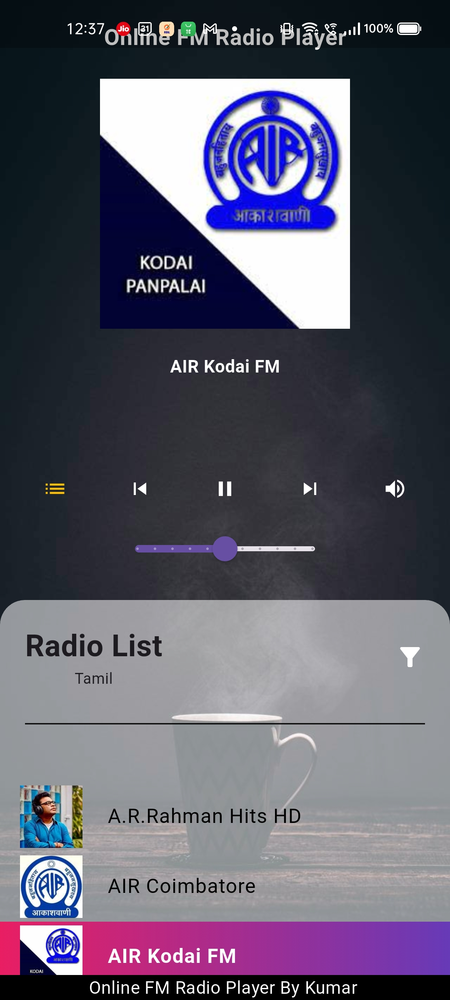
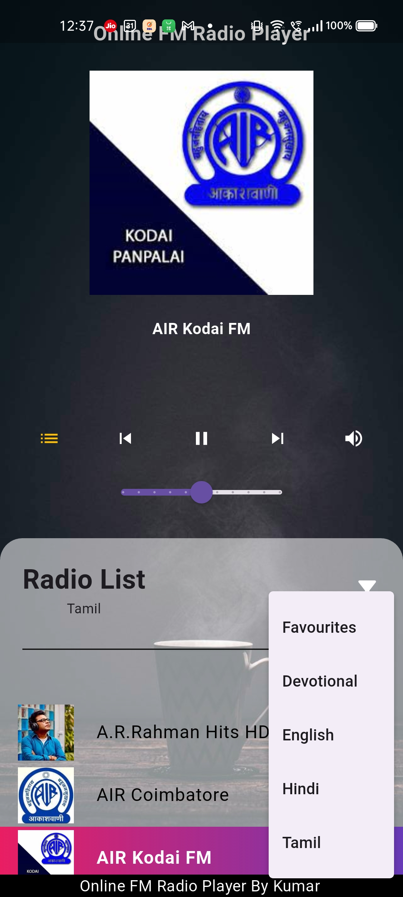
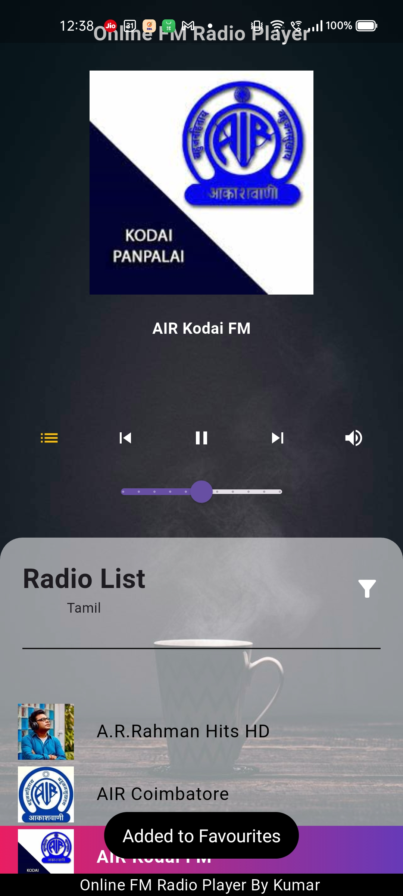
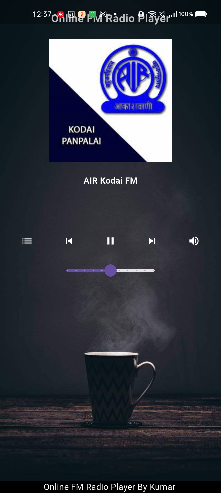

# Live Radio

A Live Radio player works in both Android, iOS platforms

## Screenshots

Here are some screenshots of the Live Radio app:

### Home Screen

### Radio Station List

### Radio Station List Filter

### Radio Station List Favourite

### Player Screen

# Download the APK

Download the APK if you want to test, explore the app

- [Download APK](release/app-release.apk)
- [SHA1 Hash] 27f824082cd655afd4da68a8f67ba4517b163678

## Getting Started

- flutter pub get

## TODO

- fetch artwork from player api
- better ui
- border radius for radio station image
- find a station is offline - implemented the method, but shows always once a state is changed
